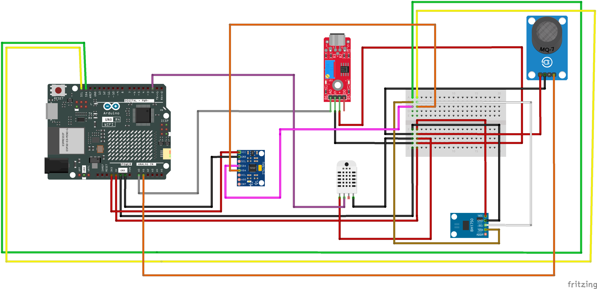

# LABORATORIO SOFTWARE IOT-CLOUD-IA

Este repositorio contiene el material **práctico y teórico** para el
laboratorio de **IoT + Cloud + IA** usando tecnologías como **MQTT,
Huawei Cloud, OpenEuler, Python, MySQL, Flask y modelos de inferencia**.
Cada sección está enlazada con el código y recursos dentro de este
repositorio según los subtítulos del laboratorio.

------------------------------------------------------------------------

# 🧠 1 --- IOT-CLOUD

## **1.1 --- Gráfico del circuito**

Incluye un esquema de conexión de dispositivos con microcontralador y tarjeta Wifi con los sensores necesarios para el laboratorio.

Materiales

✅ Arduino R4 WiFi
Para lectura de sensores y envío de datos vía serial o MQTT.

✅ ESP32-CAM
Captura y envío de imágenes para inferencia de IA.

✅ Raspberry Pi 4 
Nodo de procesamiento y pruebas con OpenEuler.

🌡️ DHT11 / DHT22 - Sensor de temperatura y humedad.

💡 BH1750 - Sensor de luminosidad (lux).

🧭 MPU6050 - Acelerómetro y giroscopio (movimiento y orientación).

🛢️ MQ-7 - Sensor de Monoxido de Carbono

Camara web USB

------------------------------------------------------------------------

## **1.2 --- Código Arduino**

Este código se usa para enviar datos desde un Arduino al servidor/cloud
usando MQTT.\
Ejemplo de uso dentro de: **`arduino/`**

📌 **Debes cargar el sketch en tu placa compatible y configurar el
broker MQTT (URL y credenciales).**

------------------------------------------------------------------------

## **1.3 --- Crear un ECS en Huawei Cloud**

Un **ECS (Elastic Cloud Server)** es una instancia de máquina virtual
dentro de Huawei Cloud donde puedes desplegar servicios (por ejemplo,
MQTT Broker, API, bases de datos).

-   Inicia sesión en **Huawei Cloud Console**.\
-   Elige **ECS \> Crear instancia** y selecciona configuración de
    red/SO.\
-   Asigna **IP pública o elástica** para acceso externo.\
-   Accede con **SSH** y configura tus servicios.

------------------------------------------------------------------------

## **1.4 ---  Instalación y configuración MQTT en OpenEuler**

MQTT es un **protocolo ligero de mensajería para IoT**.

En tu ECS con OpenEuler, instala un broker (por ejemplo, Mosquitto):

    sudo dnf install mosquitto
    sudo systemctl enable --now mosquitto

Configura el archivo **mosquitto.conf** para permitir conexiones.

📌 **El broker escuchará conexiones MQTT a las que tus dispositivos se
suscribirán/publicarán.**

------------------------------------------------------------------------

## **1.5 --- Test Python MQTT**

📄 **Archivo:** `1.5_iot_test_mqtt.py`

Este script prueba la conexión vía MQTT desde Python al broker, publica
y/o consume mensajes.

------------------------------------------------------------------------

## **1.6 --- Código Arduino --- con MQTT**

Versión más completa del sketch Arduino que se conecta al broker MQTT
con credenciales y publica datos periódicamente.

📌 **Ajusta las variables como URL y topics según tu broker
configurado.**

------------------------------------------------------------------------

## **1.7 ---  Instalación y configuración MySQL en OpenEuler**

MySQL es un **motor de base de datos relacional** que almacenará los
eventos/datos recolectados desde MQTT.

En tu ECS con OpenEuler:

    sudo dnf install mysql-server
    sudo systemctl enable --now mysqld

Asegura tu instalación (**mysql_secure_installation**).\
Crea base y tablas para almacenar los datos de IoT.

------------------------------------------------------------------------

## **1.7 --- Script para base de datos**

📄 **Archivo:** `1.7_bd.sql`

Contiene el esquema de la base de datos (tablas y campos).

Importa con:

    mysql -u root -p < 1.7_bd.sql

------------------------------------------------------------------------

## **1.8 --- Código de almacenamiento MQTT a MySQL**

📄 **Archivo:** `1.8_iot_to_mysql_safety.py`

Este script: - Se conecta al broker MQTT.\
- Se subscribe a topics.\
- Inserta los mensajes recibidos en MySQL.

Este puente permite la persistencia de datos IoT.

------------------------------------------------------------------------

## **1.9 --- Construcción de API para consumo de datos**

📄 **Archivo:** `1.9_iot_api_data.py`

Construcción de una API ( con Flask) para exponer datos.

Ejemplos: - `/messages` → devuelve datos IoT\
- `/status` → estado del servidor

------------------------------------------------------------------------

## **1.10 --- Test Python API**

📄 **Archivo:** `1.10_iot_test_data.py`

Script que consume la API y valida su funcionamiento.

------------------------------------------------------------------------

## **1.11 --- Conexión a Power BI**

Para visualizar datos: - Power BI Desktop → **Obtener datos \>
Web/API**\
- Ingresa la URL de tu API.\
- Carga y crea dashboards.

------------------------------------------------------------------------

# 🧠 2 --- IA-CLOUD

El objetivo es usar IA para inferencia de imágenes y exponerlo como API.

------------------------------------------------------------------------

## **2.1 --- Notebook Python con CLIP**

📄 **Archivo:** `2.1_inferencia_local.py`

------------------------------------------------------------------------

## **2.2 --- Crear API Flask Python**

📄 **Archivo:** `2.2_api_inferencia.py`

------------------------------------------------------------------------

## **2.3 --- Código test para probar API**

📄 **Archivo:** `2.3_test_api_inferencia.py`

------------------------------------------------------------------------

## **2.4 --- Código ESP32-CAM**

Captura imágenes y las envía a la API.

------------------------------------------------------------------------

## **2.5 --- PC con OpenEuler**

📄 **Archivo:** `2.5_inferencia_cam_local.py`

------------------------------------------------------------------------

## **2.6 --- Raspberry con OpenEuler**

📄 **Archivo:** `2.6_inferencia_raspberry.py`

------------------------------------------------------------------------

## **2.7 --- Inferencia local en Raspberry**

*(Pendiente de implementación)*

------------------------------------------------------------------------

# 📌 Notas de teoría relevantes

## ☁️ Sobre MQTT y Huawei IoT

MQTT es un protocolo ligero para mensajería IoT.\
Huawei IoT Device SDK facilita la conexión a Huawei Cloud IoTDA.

------------------------------------------------------------------------

# 📌 Tips útiles

### ✔ Revisa variables de conexión

-   Broker MQTT\
-   Usuario / contraseña\
-   Base de datos MySQL

### ✔ Prueba paso a paso

1.  MQTT local\
2.  MySQL\
3.  API\
4.  Visualización

------------------------------------------------------------------------

# 📄 Licencia

Los materiales, laboratorios y ejemplos incluidos en este repositorio
han sido elaborados como apoyo para actividades académicas y están
alineados a los lineamientos y objetivos de la **Huawei Teaching
Competition**, con fines de formación, demostración tecnológica y
fortalecimiento de competencias en **IoT, Cloud e Inteligencia
Artificial**.

Arduino es una marca registrada de Arduino AG. 
Este proyecto utiliza placas y herramientas compatibles con Arduino únicamente con fines educativos y demostrativos. 
El uso del nombre Arduino en este repositorio es solo referencial y no implica afiliación, patrocinio ni aprobación oficial por parte de Arduino.
